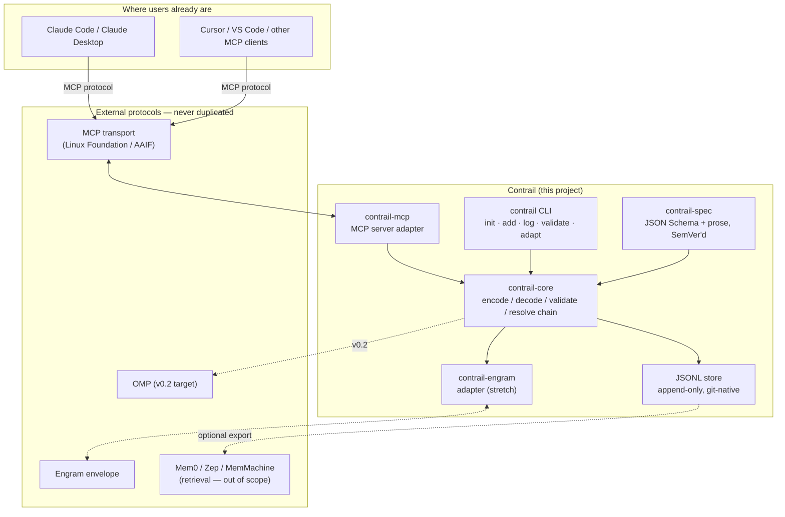
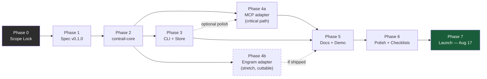

# Contrail Design Document

*Engineering Design Document & 32-Day Execution Plan*
*Prepared as if reviewed by the founding engineering leads of Git, SQLite, Docker, Kubernetes, Rust, HTTP, OAuth, JSON, OpenAPI, Linux, and PostgreSQL.*
*Launch target: **17 August 2026** · Document date: **16 July 2026** · Author of record: solo founder, open source, TypeScript-first.*

---

## 0. Executive Verdict (read this first)

**The project as originally scoped should not be built. A narrower, honest, and genuinely useful project should be built in its place, under a new name.**

Three hard facts, verified today, change everything about this plan:

1. **The "universal AI interoperability standard" slot is already filled — twice, formally, with foundation governance.** MCP (tool/data connectivity) and A2A (agent-to-agent task delegation, having absorbed IBM's ACP in August 2025) are both now governed by the Linux Foundation, backed jointly by Anthropic, OpenAI, Google, Microsoft, AWS, Block, Bloomberg and 150+ other organizations, with tens of millions of monthly downloads and thousands of production servers. This did not happen gradually — it happened in the last seven months. A solo developer cannot out-govern, out-fund, or out-adopt a Linux Foundation project in 32 days. Competing with MCP or A2A head-on is not ambitious, it is a category error.

2. **The specific niche OpenMind's mission statement actually points at — portable, cross-tool personal memory/identity — is not empty either.** It is a live, crowded, fast-moving micro-war *right now*, with at least four independent open efforts published in the last two months alone: **Engram** (signed JSON envelope, "OAuth for AI memory," SSRN paper + reference repo, June 2026), **Open Memory Protocol / OMP** (MCP-native memory store with CLI and multi-tool adapters), **01 Protocol** (cryptographically verifiable portable agent identity, `.01ai` file format), and an academic **Portable Agent Memory** protocol (cryptographic memory transfer, arXiv, May 2026). None has won yet. All are pre-v1. This is exactly the kind of moment a small, sharp entrant *can* meaningfully affect — but only by **not being a fifth redundant "universal envelope format."** Duplicating Engram's five-object envelope with different field names is not a contribution, it's noise.

3. **The name "OpenMind" is unusable.** It collides with at least six unrelated, actively maintained open-source projects on GitHub today (a robotics HAL runtime, a 49-repo ML organization, an AGI experiment, a mind-mapping tool for the OpenClaw agent framework, a BCI hardware project, and a research-analysis tool), several with GitHub orgs and npm-adjacent tooling already in place. Launching under this name guarantees search-engine and package-registry confusion on day one. This is fixed in fifteen minutes, not because it's hard, but because it must be decided *before* any code is written, and then never revisited.

**Decision, stated once, final:** Kill the "universal standard for representing intelligence." Build **Contrail** — a small, boring, git-native specification and reference library for **confidence-weighted, versioned personal-context claims that evolve over time** ("trajectories"), which rides *on top of* MCP (does not replace its transport) and translates *into and out of* Engram and OMP (does not replace their envelopes). The one genuinely new primitive Contrail contributes — and the reason it is allowed to exist — is **first-class temporal supersession with confidence scoring**: the ability to say not just "the user prefers X" but "the user believed X with 0.6 confidence from March to June, then explicitly revised to Y at 0.9 confidence, and here is the chain." None of the four competitors model this as a first-class citizen today. That, and only that, is the wedge. Everything else in this document follows from that one sentence.

This reframing is also the only version of this idea that is honest about *why now*: the underlying philosophy — that a person's model of themselves is not static and an AI system should represent that explicitly rather than silently overwriting old beliefs with new ones — is exactly the same idea already driving your own personal AI project, with trajectory-based user modeling and separated memory/inference layers. Contrail is that idea, extracted into a spec small enough to publish, demo, and defend in 32 days. Don't run two parallel efforts — Contrail can be the open-source face of the same architecture.

The rest of this document builds the full plan around this decision. Section 1 shows the work. Sections 2–11 are the resulting deliverables.

---

## 1. Critical Analysis — Does This Deserve To Exist?

### 1.1 Landscape verdict table

| Technology | Problem it actually solves | Overlaps with original vision | Does NOT overlap | Duplicate it? | Integrate? | Depend on it? |
|---|---|---|---|---|---|---|
| **MCP** (Model Context Protocol) | Wire format + lifecycle for an AI app to call tools and read resources from external servers. Linux-Foundation-governed since Dec 2025 (Agentic AI Foundation), 10,000+ servers, 97M+ monthly SDK downloads, IETF-track hardening shipping July 2026. | Transport, tool/resource discovery | Does not define what a *claim about a person* looks like, no confidence model, no belief history | **No.** | **Yes, primary.** Contrail claims are exposed as an MCP resource + three tools. | **Yes.** The flagship adapter is an MCP server — this is how it reaches users on day one. |
| **A2A** (Agent2Agent) | Task delegation between autonomous agents — Agent Cards, task lifecycle, artifact exchange. Google → Linux Foundation, v1.0 April 2026, 150+ supporting orgs, absorbed IBM's ACP. | "Agent description" | Not personal memory — peer-to-peer task coordination | **No.** | Document as a future export target only. Build nothing in v0.1. | No. |
| **ACP** (IBM) | FIPA-ACL negotiation semantics between agents. | None material | Negotiation, not memory | No | No | No — merged into A2A governance in Aug 2025; treat as historical. |
| **Engram** | Signed, user-governed memory envelope: IDENTITY/BELIEFS/CONSTRAINTS/CORRECTIONS/EVOLUTION, Ed25519 signing, scoped export, HTTP API. Published June 2026. | Nearly the entire "identity + memory" scope of the original vision | No first-class confidence-scored temporal chain — "EVOLUTION" reads as a changelog, not a queryable supersession graph | **No — do not re-invent this envelope.** | **Yes.** Bidirectional adapter; Engram envelopes are one valid serialization target. | No (stretch adapter, doesn't block v0.1 core). |
| **OMP** (Open Memory Protocol) | Already-shipping MCP-native memory store + CLI + per-tool adapters (Claude Code, Cursor, Copilot). | Storage + injection mechanics | Flat memories, no supersession chain, no confidence | **No.** | Adapter deferred to v0.2 — one external adapter (Engram) is enough to prove the pattern for v0.1. | No. |
| **01 Protocol** | Cryptographically verifiable portable identity file (`.01ai`) with per-platform injection profiles. | Identity portability | No memory/claim model | No | Deferred — revisit once Contrail needs a signed identity anchor (v0.2). | No. |
| **OpenAPI** | Describes HTTP APIs for machine + human consumption. | Nothing about memory | — | No | **Style, not substance.** Contrail's schema + versioning discipline mirrors OpenAPI's spec-repo conventions. | No runtime dependency. |
| **JSON Schema** | Structural validation for JSON documents. | — | — | No | **Yes, foundational** — every claim validates against it. | **Yes**, as a library dependency (ajv). |
| **ActivityPub / Solid / Semantic Web (RDF, OWL, JSON-LD)** | Federated social graphs (ActivityPub); personal data pods with access control (Solid); universal knowledge representation (RDF/OWL). | Conceptually adjacent — "personal data you control, that travels" is Solid's entire pitch | 15+ years of evidence that generalized triple-store approaches lose to flat JSON + REST for developer adoption outside government/academia. Solid has real deployments but near-zero traction among 2026 AI tool builders. | **No — this is the single most likely scope-creep failure mode.** | None in v0.1. State the relationship honestly ("RDF-inspired, JSON-pragmatic") and stop. | No. |
| **OpenTelemetry** | Distributed tracing/metrics/logs standard. | Naming collision only ("trace," "span" are OTel-owned words) | Different problem domain entirely | No | No | No — this is *why* "Trace" was rejected as a project name. |
| **W3C AI Agent Protocol CG** | Early-stage community group drafting agent protocol specs. | Governance-adjacent | Pre-formal, low signal in 2026 | No | Watch only. | No. |
| **LangGraph / AutoGen / CrewAI / OpenAI Agents SDK / Google ADK** | Application-level agent orchestration frameworks. | None structurally — runtimes, not data formats | Different layer | No | None required — any of these can consume a Contrail claim as plain JSON with zero special-casing. | No. |
| **Anthropic ecosystem (Claude Code/Desktop, AGENTS.md)** | AGENTS.md (an AAIF founding project) standardizes repo-level agent instructions; Claude clients are MCP clients. | "Agent description" partly covered already by AGENTS.md | Not memory | No | **Yes** — flagship demo runs inside Claude Code via the MCP adapter; a claim can optionally project into a read-only `AGENTS.md` snippet. | Runtime target only. |
| **Mem0 / Zep / MemMachine / LangMem** | Memory *retrieval engines* — embeddings, ranking, benchmarked recall (LoCoMo, LongMemEval). | None structurally — they compete on retrieval quality, not portability | Contrail says what a claim is and how it evolves; these say how you find the right one fast at scale | No — do not add vector search "for completeness." | Document as a valid downstream consumer. Build nothing. | No. |

### 1.2 The one paragraph that matters

MCP solved "how do I connect an AI to a tool." A2A solved "how do two agents talk." Nobody has yet made "how does a *fact about you* explicitly carry its own confidence and revision history, small enough to fit in a git repo and travel between Engram, OMP, and any MCP client" boring and standard. That is a real, narrow, currently-open gap — not because no one is smart enough, but because everyone racing into the personal-memory niche right now is optimizing for signing, envelopes, and CLI ergonomics, not temporal semantics. That's the wedge, it's buildable solo in a month, and it's honest about not trying to be Kubernetes when the Kubernetes-equivalent already shipped in December 2025.

---

## 2. Vision (one page)

**Name:** Contrail
**Tagline:** *A vapor trail for what an AI knows about you — where it came from, how sure it is, and what it used to think before it changed its mind.*

### Why does Contrail exist?

Every AI memory system today stores the *current* belief and discards the trajectory that produced it. When a coding assistant "remembers" a preference for functional composition over classes, it silently overwrites the fact that months earlier the opposite was true, at what confidence, and why it changed. That history is the highest-signal input for modeling a person accurately, and it is being deleted today by every memory tool on the market — including the ones currently racing to become the portability standard.

### What unique problem does it solve?

It gives "a fact about you" a first-class temporal shape: `claim → confidence → supersedes(previous claim) → source`. Not storage (Mem0/Zep). Not transport (MCP). Not signing (Engram). The missing layer in between: the *shape* of a belief as it changes, expressed as a tiny, versioned, git-diffable JSON Schema with reference adapters into protocols that already move data — never a new wire protocol.

### Who is it for?

Developers and small teams building personal AI tools (coding assistants, journaling apps, companion apps) already using MCP, frustrated that "memory" everywhere means "the last thing you said, silently overwriting the thing before it." Secondary audience: Engram/OMP/01 Protocol maintainers, who get a ready-made temporal extension.

### Why now?

MCP and A2A just became boring, stable infrastructure in the last two quarters — the exact signal it's safe to build *on* them instead of racing to replace them — while the memory-portability niche is still soft enough (all four competitors pre-1.0, published within eight weeks of this document) that a sharply differentiated, well-executed small spec can get real attention.

### Why open source?

A format only one company can write to isn't a format, it's a database schema with marketing. Contrail's entire value is being adopted by tools its author doesn't control. Apache-2.0 (explicit patent grant, enterprise-safe) is the only credible license for something asking to be treated as infrastructure.

### Why should anyone adopt it?

Because trying it costs almost nothing: one JSON Schema, one npm package, one MCP server pointable from Claude Code in under five minutes, a file format so plain it's diffable JSONL sitting in a git repo already there. Switching cost is deliberately near zero, and it gives something nothing else on the market gives today — an honest, queryable history of how an AI's understanding of a person actually changed.

---

## 3. Architecture

### 3.1 System diagram



### 3.2 Subsystem table

| Subsystem | Purpose | Responsibilities | Boundaries (what it does NOT do) | Public interface | Future extensibility | v0.1? |
|---|---|---|---|---|---|---|
| **contrail-spec** | Source of truth for the data model | JSON Schema, prose spec, versioning rules, example fixtures used as conformance tests | Contains no code, no runtime logic | `contrail-claim.schema.json`, `SPEC.md` | New optional fields (minor bump), new claim kinds via `x-` extension prefix | **Yes — first thing built** |
| **contrail-core** | Reference implementation | Parse/serialize claims, validate against schema, resolve `supersedes` chains into a `Trajectory`, compute confidence-decay helper | No storage, no I/O, no network | TS library, `parseClaim()`, `validate()`, `resolveTrajectory(subject, predicate)` | Additional language SDKs (Python) once TS is stable | **Yes** |
| **contrail CLI** | Human-facing entry point | `init`, `add`, `log`, `validate`, `adapt --to=engram`, `diff` | No GUI, no daemon, no server | `contrail` npm binary | Shell completion, `--json` output mode for scripting | **Yes (minimal verb set)** |
| **JSONL store** | Default, only v0.1 storage backend | Append-only newline-delimited JSON file, one claim per line, canonical key ordering for diffability | Not a database — no query engine, no indexes | Plain file on disk, versioned in git like any other file | Pluggable `StorageBackend` interface; SQLite backend is the obvious v0.2 candidate (better random access) but is explicitly **not** built now | **Yes** |
| **contrail-mcp** | Flagship adapter and demo surface | Exposes claims as an MCP resource; exposes `contrail_remember`, `contrail_recall`, `contrail_trajectory` as MCP tools | Does not implement its own transport — rides entirely on the MCP SDK | Standard MCP server, runnable via `npx contrail-mcp` | Streamable-HTTP remote mode once local stdio proves the concept | **Yes — the single most important v0.1 artifact** |
| **contrail-engram** | Interop adapter | Bidirectional mapping between a Contrail Trajectory and an Engram envelope | Does not implement Engram's signing — delegates to Engram's own libs if present, otherwise passthrough unsigned | `toEngram(trajectory)`, `fromEngram(envelope)` | OMP adapter follows the same interface shape in v0.2 | **Stretch — only if Phase 4 finishes early (see §6)** |
| Signing (Ed25519) | Cryptographic authenticity of a claim's provenance | — | **Not implemented in v0.1.** Schema reserves a `signature` field, explicitly documented as `unimplemented — do not rely on this for trust decisions` | — | Full implementation in v0.2, audited before claiming security properties | **No — placeholder field only** |
| Sharing / consent / multi-party | Letting a claim be selectively shared with another person or agent | — | Product-layer decision (a UI, a policy engine), not spec-layer | — | v0.3+, after there's a real user asking for it | **No** |
| Retrieval / embeddings | Fast semantic search over many claims | — | Explicitly delegated to Mem0/Zep/MemMachine/etc — Contrail's JSONL log is a valid ingestion source for any of them | — | Document an ingestion recipe, build nothing | **No, ever (by design)** |
| Registry / directory of adapters | Discoverability of third-party Contrail adapters | — | Needs real external adapters to exist first | — | v0.2+, once ≥3 third-party adapters exist | **No** |
| Governance / SEP process | How the spec changes once other people depend on it | — | Premature with zero external adopters | `GOVERNANCE.md` states plainly: BDFL through v0.x, revisit at v1.0 or 3 external production adopters, whichever comes first | Formal working-group model, borrowing AAIF's SEP process as a template | **Docs only, no process machinery** |

---

## 4. Specification Design

The original brief listed: Identity, Memory, Knowledge, Projects, Goals, Context, Permissions, Events, Agent description, Versioning, Schema evolution, Validation, Serialization, Compatibility, Migration. Honest treatment of each — most collapse into the single `Claim` primitive rather than becoming separate subsystems. Building each as its own subsystem is exactly the scope creep this whole exercise exists to prevent.

### 4.1 The one primitive: `Claim`

```json
{
  "schema_version": "0.1.0",
  "id": "01J9Z8QK3N4R5S6T7V8W9X0Y1Z",
  "subject": "self",
  "predicate": "prefers.code_style.paradigm",
  "value": "functional-composition",
  "value_type": "enum",
  "confidence": 0.9,
  "valid_from": "2026-06-01T00:00:00Z",
  "valid_until": null,
  "supersedes": "01J8X7QK2M3N4P5Q6R7S8T9U0V",
  "source": { "tool": "claude-code", "session_id": "sess_a1b2", "kind": "explicit-statement" },
  "visibility": "private",
  "signature": null
}
```

### 4.2 Component-by-component ruling

| Requested component | Exists in Contrail v0.1? | What it actually becomes | What must NEVER belong inside it |
|---|---|---|---|
| **Identity** | Minimal | A `subject` string (defaults to `"self"`; extensible to any opaque identifier). No login, no account system. | A full identity provider, OAuth/OIDC flow, or password store — that is OAuth's and OIDC's job, not ours. |
| **Memory** | **Yes — this IS the spec** | The `Claim` object itself and its `supersedes` chain (a `Trajectory`). | Embeddings, vector indexes, similarity search — that's a retrieval engine's job (Mem0/Zep/etc). |
| **Knowledge** | Rejected as a separate concept | A "known fact" is just a `Claim` with high confidence and no active supersession — no separate subsystem. | An RDF triple store, an ontology, a reasoning/inference engine. |
| **Projects** | Rejected as a first-class subsystem | Just a `predicate` namespace convention, e.g. `predicate: "project.active.merlo360"`. | A kanban board, task states, deadlines — that's a product (Linear, Notion), not infrastructure. |
| **Goals** | Same treatment as Projects | `predicate: "goal.active.*"` — just a claim. | A scheduler, reminder engine, or notification system. |
| **Context** | Not separate — it's the umbrella the whole spec models | — | — |
| **Permissions** | Minimal, label-only | `visibility: "private" \| "shared"` plus a free-text `scope` tag. Contrail *labels* the claim; it does not *enforce* access — same relationship a JWT has to an authorization server. | A full ABAC/RBAC policy engine, an enforcement runtime. |
| **Events** | Rejected as a separate concept | Every claim creation already **is** an event — the append-only JSONL + git history gives you a complete event log for free. | A pub/sub broker, a message queue — that's infrastructure the consumer already has. |
| **Agent description** | **Explicitly out of scope, permanently** | Nothing — this is A2A's Agent Card and MCP's server descriptor. Contrail never describes what an agent *can do*, only what is *believed about a subject*. | Any form of capability manifest. Duplicating this is the single fastest way to look like "yet another competing standard." |
| **Versioning** | **Yes, critical** | `contrail-spec` itself is SemVer'd independently of code releases (`spec/CHANGELOG.md`); every claim carries `schema_version`. | Silent, undocumented breaking changes. |
| **Schema evolution** | **Yes** | Additive-only within a MINOR bump (new optional fields); MAJOR bump required for anything breaking, paired with a migration script. | A MINOR bump that breaks existing valid documents — that's actually a MAJOR bump mislabeled. |
| **Validation** | **Yes, non-negotiable** | JSON Schema (ajv) + `contrail validate` CLI command; every example in the spec repo is a CI-enforced fixture. | Validation logic duplicated ad hoc inside every adapter instead of living once in `contrail-core`. |
| **Serialization** | **Yes** | Canonical form: newline-delimited JSON (JSONL), UTF-8, sorted object keys, one claim per line — chosen specifically so `git diff` is readable and merges are line-based. | A binary format, protobuf, or anything that defeats `git diff` for v0.1. (Not ruled out forever — just not now.) |
| **Compatibility** | **Yes, documented** | An explicit field-mapping table for Engram ⇄ Contrail (§4.3), with every lossy conversion called out in writing — never silently dropped. | Claims of full round-trip fidelity that aren't actually true. |
| **Migration** | **Yes** | `contrail migrate --to 0.2.0` command; every migration writes a log entry, never silently mutates data in place without a record. | Silent in-place rewrites with no audit trail. |

### 4.3 Compatibility notes (Engram ⇄ Contrail, v0.1 honesty check)

| Engram field | Contrail equivalent | Lossy? |
|---|---|---|
| `IDENTITY` object | `subject` + a set of `predicate: "identity.*"` claims | No |
| `BELIEFS` object | `predicate: "belief.*"` claims | No |
| `CONSTRAINTS` / "NEVER rules" | `predicate: "constraint.*"`, `confidence: 1.0`, `valid_until: null` | No |
| `CORRECTIONS` | Directly maps to `supersedes` | No — this is the closest existing match to Contrail's core idea |
| `EVOLUTION` | Directly maps to the resolved `Trajectory` (ordered `supersedes` chain) | No |
| Ed25519 signature | `signature` field | **Yes, in v0.1** — Contrail does not implement signing yet; import preserves the signature as an opaque blob, export leaves it null. Documented, not hidden. |


---

## 5. Repository Design

**One repository, npm workspaces, single language (TypeScript) for v0.1.** A multi-repo split is explicitly rejected — it multiplies release/CI overhead for a solo maintainer with no payoff until there are external contributors to isolate. **License: Apache-2.0** for spec and code (explicit patent grant — the only defensible choice for something asking to be treated as infrastructure). **Contribution model: DCO sign-off, not a CLA** — lower friction, standard for solo-maintainer OSS.

```
contrail/
├── README.md                     # what it is, 5-minute quickstart, badge row
├── LICENSE                       # Apache-2.0
├── CODE_OF_CONDUCT.md            # Contributor Covenant, unmodified
├── CONTRIBUTING.md                # DCO instructions, how to propose a schema change
├── GOVERNANCE.md                  # "BDFL through v0.x; revisit at v1.0 or 3 external adopters"
├── CHANGELOG.md                   # code releases (Keep a Changelog format)
├── package.json                   # npm workspaces root, no code here
├── tsconfig.base.json
├── .github/
│   ├── workflows/
│   │   ├── ci.yml                 # lint + typecheck + unit tests on every PR
│   │   ├── spec-validate.yml      # validates every fixture in spec/examples against the schema
│   │   └── release.yml            # publish to npm on tag push, generates changelog entry
│   ├── ISSUE_TEMPLATE/
│   │   ├── bug_report.md
│   │   ├── feature_request.md
│   │   └── spec_proposal.md       # required template for anyone proposing a schema change
│   └── PULL_REQUEST_TEMPLATE.md
├── spec/
│   ├── SPEC.md                     # normative prose spec
│   ├── CHANGELOG.md                # spec-only changelog, decoupled from code release cadence
│   └── schema/
│       └── v0.1/
│           ├── claim.schema.json   # normative JSON Schema
│           └── examples/
│               ├── valid/          # fixtures that MUST pass — CI-enforced
│               └── invalid/        # fixtures that MUST fail, with expected error codes
├── packages/
│   ├── core/                       # contrail-core
│   │   ├── src/{parse,validate,resolveTrajectory,decay}.ts
│   │   └── test/
│   ├── cli/                        # contrail (npm bin)
│   │   ├── src/commands/{init,add,log,validate,adapt,diff}.ts
│   │   └── test/
│   └── adapters/
│       ├── mcp/                    # contrail-mcp — the flagship
│       │   ├── src/{server,tools,resources}.ts
│       │   └── test/
│       └── engram/                 # contrail-engram — stretch goal, may ship empty in v0.1
│           ├── src/{toEngram,fromEngram}.ts
│           └── test/
├── examples/
│   └── coding-assistant-memory/    # THE flagship demo — runnable end to end
│       ├── README.md               # "5 minutes: point Claude Code at this"
│       └── seed.jsonl
├── docs/                           # single documentation surface — no separate "website/" dir
│   ├── index.md                    # quickstart, published via GitHub Pages, plain markdown
│   ├── spec-explorer.md            # human-readable walk-through of the schema
│   └── faq.md                      # "how is this different from Engram/OMP/MCP" — answered directly
└── scripts/
    ├── validate-examples.sh
    └── release.sh
```

**Explicit rejections, stated once:**
- No separate `website/` directory — one documentation surface (`docs/`), published as GitHub Pages directly from markdown. A custom Docusaurus site is a good v0.2 problem, not a v0.1 problem.
- No Python SDK in v0.1 — TypeScript only, until the spec itself has stopped changing weekly.
- No `packages/adapters/omp/` in v0.1 — one adapter (Engram, stretch) is the right amount of proof; two adapters before the core spec is validated by real usage is premature generalization.


---

## 6. Execution Roadmap

Seven phases, 33 days (16 Jul → 17 Aug inclusive). Every task below is sized to fit under two hours.

### Phase 0 — Scope Lock & Validation (Days 1–2, Jul 16–17)

**Objective:** Kill ambiguity before writing a line of spec or code. **Dependencies:** none. **Risk:** spending more than 2 days here — hard stop enforced. **Completion criteria:** name chosen and registered, repo skeleton exists, this document accepted as final scope.

| Task | Output | Est. |
|---|---|---|
| Verify `contrail` availability on npm, GitHub org, and as a `.dev`/`.build` domain; if taken, fall back to `lukitadproxd-netizen` | Decision recorded in `GOVERNANCE.md` | 30 min |
| Register GitHub org / repo, npm org (scoped `@contrail` if root name taken) | Live, empty repo | 20 min |
| Write one paragraph "why this and not Engram/OMP" — this becomes `docs/faq.md` §1 later, but write it now as a gut check | Paragraph in a scratch file | 45 min |
| Choose license (Apache-2.0) and add `LICENSE` | File committed | 10 min |
| Set up npm workspaces root `package.json`, `tsconfig.base.json` | Builds with zero packages | 30 min |
| Create `.github/workflows/ci.yml` skeleton (lint + test, currently no-op) | Green CI badge from commit one | 45 min |
| Re-read §1 and §4 of this document, confirm no scope drift before Phase 1 starts | Go/no-go decision | 15 min |

### Phase 1 — Spec v0.1.0 (Days 3–9, Jul 18–24)

**Objective:** A frozen, validated, documented JSON Schema — the source of truth everything else depends on. **Dependencies:** Phase 0. **Risk:** bikeshedding field names — timebox each field decision to 15 minutes, default to the name in §4.1 if undecided. **Completion criteria:** `claim.schema.json` validates all example fixtures in CI; `SPEC.md` complete; tagged `spec-v0.1.0`.

| Task | Output | Est. |
|---|---|---|
| Define `Claim` required fields (`id`, `subject`, `predicate`, `value`, `confidence`) | Schema draft | 1 hr |
| Define `Claim` optional fields (`value_type`, `valid_from`, `valid_until`, `supersedes`, `source`, `visibility`, `signature`) | Schema draft | 1 hr |
| Define ID format (ULID) and write rationale (sortable, no coordination needed — Git committee preference) | `SPEC.md` §2 | 30 min |
| Define `confidence` semantics: float 0.0–1.0, monotonic meaning documented (not enforced) | `SPEC.md` §3 | 45 min |
| Define `supersedes` chain rules: must reference an existing `id`, cycles are invalid | `SPEC.md` §4 + schema `not` rule stub | 1 hr |
| Define `predicate` namespacing convention (`category.subcategory.key`) with 5 worked examples | `SPEC.md` §5 | 1 hr |
| Define `schema_version` field and SemVer compatibility rule (additive-only within minor) | `SPEC.md` §6 | 45 min |
| Write 8 valid example fixtures covering every field combination | `spec/schema/v0.1/examples/valid/*.json` | 2 hr |
| Write 8 invalid example fixtures, each with an expected error code | `spec/schema/v0.1/examples/invalid/*.json` | 1.5 hr |
| Wire `spec-validate.yml` to run ajv against every fixture on every PR | Passing CI job | 1 hr |
| Write the Contrail ⇄ Engram compatibility table into `SPEC.md` (content from §4.3 above) | `SPEC.md` §7 | 1 hr |
| Tag `spec-v0.1.0`, freeze — no further field changes without a MAJOR bump discussion | Git tag | 15 min |

### Phase 2 — Core Library, `contrail-core` (Days 10–16, Jul 25–31)

**Objective:** Reference TypeScript implementation. **Dependencies:** Phase 1 frozen spec. **Risk:** over-building the decay function into a research project — timebox to one simple exponential-decay reference implementation, documented as non-normative. **Completion criteria:** 90%+ test coverage on `parse`/`validate`/`resolveTrajectory`; published as `contrail-core@0.1.0` on npm.

| Task | Output | Est. |
|---|---|---|
| Scaffold `packages/core` with build/test config | Package builds | 45 min |
| Implement `parseClaim(json): Claim \| ParseError` | Function + unit tests | 1.5 hr |
| Implement `validate(claim): ValidationResult` wrapping ajv against the frozen schema | Function + unit tests | 1.5 hr |
| Implement `resolveTrajectory(claims[], subject, predicate): Trajectory` (walks `supersedes` chains) | Function + unit tests | 2 hr |
| Implement cycle detection in `resolveTrajectory` | Test case + fix | 1 hr |
| Implement `decay(confidence, elapsedMs, halfLifeMs): number` as a documented, optional, non-normative helper | Function + unit tests | 1 hr |
| Write property-based tests: every fixture in `spec/schema/v0.1/examples/valid` round-trips through parse→serialize losslessly | Test suite | 1.5 hr |
| Write canonical JSONL serializer (sorted keys, one claim per line) | Function + unit tests | 1 hr |
| Write `README.md` for `contrail-core` with a 10-line usage example | File | 45 min |
| Publish `contrail-core@0.1.0` to npm (dry-run first) | Live package | 30 min |

### Phase 3 — CLI + Git-Native Store (Days 17–19, Aug 1–3)

**Objective:** A human can use this without writing code. **Dependencies:** Phase 2. **Risk:** none major — this is the most mechanical phase. **Completion criteria:** `npx contrail init && contrail add ... && contrail log` works end to end on a clean machine.

| Task | Output | Est. |
|---|---|---|
| Scaffold `packages/cli` with commander.js, wire to `contrail-core` | Binary skeleton | 1 hr |
| `contrail init` — creates `.contrail/claims.jsonl` in current directory | Command | 45 min |
| `contrail add <predicate> <value> [--confidence] [--supersedes]` — appends a validated claim | Command | 1.5 hr |
| `contrail log [predicate]` — prints the resolved trajectory, newest first, confidence shown | Command | 1.5 hr |
| `contrail validate` — validates the whole store, exits non-zero on any invalid line | Command | 1 hr |
| `contrail diff <predicate>` — shows the belief-change delta between two points in time, human-readable | Command | 1.5 hr |
| End-to-end smoke test on a fresh temp directory in CI | CI job | 1 hr |
| `README.md` quickstart rewritten around actual CLI output (not hypothetical) | File | 1 hr |

### Phase 4 — Adapters (Days 20–26, Aug 4–10)

**Objective:** Prove Contrail reaches users where they already are. **Dependencies:** Phase 2 (core), Phase 3 (store) not strictly required but helpful for the demo. **Risk:** this is the phase most likely to overrun — MCP server auth/lifecycle edge cases. If behind schedule by Day 24, **cut the Engram adapter entirely**, MCP is non-negotiable. **Completion criteria:** `npx contrail-mcp` runs and is usable from Claude Code; Engram adapter round-trips the 8 valid fixtures (stretch).

| Task | Output | Est. |
|---|---|---|
| Scaffold `packages/adapters/mcp` with the official MCP TypeScript SDK | Package builds | 1 hr |
| Implement `contrail_remember(predicate, value, confidence)` MCP tool | Tool + test | 1.5 hr |
| Implement `contrail_recall(predicate)` MCP tool → returns current claim | Tool + test | 1 hr |
| Implement `contrail_trajectory(predicate)` MCP tool → returns full resolved chain | Tool + test | 1.5 hr |
| Expose the JSONL store as an MCP resource (read-only) | Resource + test | 1.5 hr |
| Manual end-to-end test: connect Claude Code to the local server via stdio, run a real conversation, confirm claims persist across sessions | Recorded transcript for the demo | 1.5 hr |
| Write `contrail-mcp` install instructions (`claude mcp add contrail -- npx contrail-mcp`) | README section | 45 min |
| **[Stretch, cut first if behind]** Scaffold `packages/adapters/engram`, implement `toEngram()` | Function + test | 1.5 hr |
| **[Stretch]** Implement `fromEngram()`, round-trip the 8 fixtures, document the one lossy field (signature) | Function + test | 1.5 hr |

### Phase 5 — Docs, Examples, Demo Assets (Days 27–30, Aug 11–14)

**Objective:** A stranger can understand and try this in under 10 minutes. **Dependencies:** Phase 4. **Risk:** perfectionism on prose — timebox each doc page to 90 minutes, ship v1 of the words. **Completion criteria:** `docs/` published via GitHub Pages; flagship example runs from a clean clone; a 90-second demo recording exists.

| Task | Output | Est. |
|---|---|---|
| Write `docs/index.md` quickstart (install → init → add → connect to Claude Code) | Page | 1.5 hr |
| Write `docs/spec-explorer.md` — annotated walk-through of one real claim | Page | 1.5 hr |
| Write `docs/faq.md` — "why not just use Engram/OMP/MCP directly," answered head-on, no hedging | Page | 1.5 hr |
| Build `examples/coding-assistant-memory/` with a realistic seed `claims.jsonl` (architecture opinions with visible confidence changes) | Runnable example | 2 hr |
| Record a 90-second terminal + Claude Code screen capture showing a trajectory diff in action | Video file for README/launch post | 1.5 hr |
| Enable GitHub Pages from `docs/`, verify it builds | Live docs URL | 45 min |
| Full read-through of `README.md` as if seeing it cold — cut anything that isn't load-bearing | Edited README | 1 hr |

### Phase 6 — Repo Polish & Launch Prep (Days 31–32, Aug 15–16)

**Objective:** Everything an evaluator checks in the first 60 seconds is correct. **Dependencies:** Phases 1–5 complete. **Risk:** scope creep disguised as "polish" — new features are banned in this phase, full stop. **Completion criteria:** every item in §11 checked.

| Task | Output | Est. |
|---|---|---|
| Run every checklist in §11 literally, item by item | Checked list | 2 hr |
| Fresh-machine test: clone repo in a clean container, follow only the README, confirm zero undocumented steps | Pass/fail log | 1.5 hr |
| Write the launch post (Show HN / Twitter-X thread / Reddit r/programming) — lead with the demo video, not the philosophy | Draft post | 1.5 hr |
| Tag `v0.1.0` release across `contrail-core`, `contrail-mcp`, CLI | GitHub release + npm publish | 1 hr |
| Final look at `docs/faq.md` — confirm the MCP/A2A/Engram/OMP positioning is still accurate as of launch week | Sign-off | 30 min |

### Phase 7 — Launch (Day 33, Aug 17)

**Objective:** Ship. **Dependencies:** everything. **Completion criteria:** repo public, release tagged, launch post live, author present to respond to the first wave of comments/issues for the day.

| Task | Output | Est. |
|---|---|---|
| Flip repo visibility to public (if it was private during build) | Public repo | 5 min |
| Publish launch post | Live post | 15 min |
| Monitor and respond to first comments/issues for the rest of the day | Response log | Rest of day |
| Triage every issue opened on day one into `good-first-issue`, `spec-question`, or `bug` | Labeled issues | Ongoing |

---

## 7. Dependency Graph



**Critical path:** Phase 0 → Phase 1 → Phase 2 → Phase 4a (MCP adapter) → Phase 5 → Phase 6 → Phase 7. This is the sequence that must never slip.

**Parallelizable:** Phase 3 (CLI) and Phase 4a (MCP adapter) both depend only on Phase 2 and can be worked in either order or interleaved — CLI is lower-risk and can absorb schedule slack; MCP is higher-value and should get first attention if only one can be done well by Day 26.

**Blocker relationships:**
- Nothing in Phase 4, 5, 6, or 7 can start meaningfully before the schema is frozen at the end of Phase 1 — this is why Phase 1 is protected by the hardest timebox in the plan (7 days, no exceptions).
- Phase 4b (Engram adapter) blocks nothing downstream — it is deliberately a leaf node. If it's dropped, Phase 5 proceeds with one adapter (MCP) instead of two, and `docs/faq.md` says "Engram adapter: planned for v0.2" instead of hiding the gap.

**Explicitly optional / future work (not on any path to Aug 17):** OMP adapter, 01 Protocol interop, Ed25519 signing implementation, SQLite storage backend, Python SDK, registry/directory, formal governance process.

---

## 8. Day-by-Day Schedule (16 Jul – 17 Aug 2026)

Every 7th day (Sundays) is intentionally light — review and buffer, not zero-output. Running a cash-flow-critical solo business alongside this means burnout is the single biggest real risk to the Aug 17 date; the schedule is built to survive one bad day per week without slipping.

| Day | Date | Phase | Objective | Expected output | Success criteria |
|---|---|---|---|---|---|
| 1 | Wed 16 Jul | P0 | Name + license + org | Repo skeleton live | CI badge green on an empty repo |
| 2 | Thu 17 Jul | P0 | Positioning paragraph, workspaces config | Scope frozen | This document's §0 re-read and accepted, no notes |
| 3 | Fri 18 Jul | P1 | Required fields | Schema draft v0 | `id`,`subject`,`predicate`,`value`,`confidence` defined |
| 4 | Sat 19 Jul | P1 | Optional fields + ID rationale | Schema draft v1 | All 12 fields have a written rationale sentence |
| 5 *(light)* | Sun 20 Jul | P1 | Rest / re-read spec draft cold | Notes only | No new fields added today, by rule |
| 6 | Mon 21 Jul | P1 | Confidence + supersedes semantics | `SPEC.md` §3–4 | Cycle-detection rule written down |
| 7 | Tue 22 Jul | P1 | Predicate namespacing + versioning | `SPEC.md` §5–6 | 5 worked predicate examples |
| 8 | Wed 23 Jul | P1 | Valid + invalid fixtures | 16 fixture files | `spec-validate.yml` passes on valid, fails correctly on invalid |
| 9 | Thu 24 Jul | P1 | Compatibility table, freeze | `spec-v0.1.0` tag | Tag exists, CI green |
| 10 | Fri 25 Jul | P2 | Scaffold + `parseClaim` | Package + tests | `parseClaim` round-trips all 8 valid fixtures |
| 11 | Sat 26 Jul | P2 | `validate()` | ajv wired in | Rejects all 8 invalid fixtures with correct error codes |
| 12 *(light)* | Sun 27 Jul | P2 | Rest / catch-up buffer | — | Explicitly no new feature work |
| 13 | Mon 28 Jul | P2 | `resolveTrajectory` core | Function + tests | Correct ordering on a 4-claim synthetic chain |
| 14 | Tue 29 Jul | P2 | Cycle detection | Test + fix | Malformed cyclic fixture correctly rejected |
| 15 | Wed 30 Jul | P2 | `decay()` + canonical JSONL serializer | Functions + tests | Serializer output is stable (same input → byte-identical output twice) |
| 16 | Thu 31 Jul | P2 | Publish `contrail-core@0.1.0` | Live npm package | `npm install contrail-core` works from a clean directory |
| 17 | Fri 1 Aug | P3 | CLI scaffold + `init`/`add` | Two commands work | `contrail init && contrail add` produces a valid JSONL line |
| 18 | Sat 2 Aug | P3 | `log` + `validate` commands | Two commands work | `contrail log` shows correct trajectory ordering |
| 19 *(light)* | Sun 3 Aug | P3 | `diff` command + smoke test in CI | Command + CI job | Fresh-clone smoke test passes |
| 20 | Mon 4 Aug | P4 | MCP server scaffold + `contrail_remember` | Tool live | Callable from an MCP inspector tool |
| 21 | Tue 5 Aug | P4 | `contrail_recall` + `contrail_trajectory` | Two more tools live | Both return correct data against seed fixtures |
| 22 | Wed 6 Aug | P4 | MCP resource exposure | Resource live | Claude Code can read the resource |
| 23 | Thu 7 Aug | P4 | Real Claude Code end-to-end session | Recorded transcript | A claim added in session 1 is recalled correctly in session 2 |
| 24 | Fri 8 Aug | P4 | **Decision point**: on schedule → start Engram adapter; behind → skip straight to docs | Go/no-go logged | Written decision, no second-guessing after |
| 25 *(light)* | Sun 9 Aug | P4/buffer | Engram adapter (if greenlit) or rest | — | — |
| 26 | Mon 10 Aug | P4 | Finish adapters, MCP install docs | README section | `claude mcp add contrail` works copy-pasted from README |
| 27 | Tue 11 Aug | P5 | `docs/index.md` + `spec-explorer.md` | Two pages | Both readable start to finish without external context |
| 28 | Wed 12 Aug | P5 | `docs/faq.md` (positioning vs MCP/A2A/Engram/OMP) | Page | Every question answered in ≤3 sentences, no hedging |
| 29 | Thu 13 Aug | P5 | Flagship example + demo recording | Example + video | Example runs from clean clone; video is ≤90 seconds |
| 30 | Fri 14 Aug | P5 | GitHub Pages live, README final pass | Live docs site | Cold read-through finds zero broken links |
| 31 | Sat 15 Aug | P6 | Run every checklist in §11 | Checked items | Zero unchecked boxes |
| 32 | Sun 16 Aug | P6 | Fresh-machine test, launch post draft, tag `v0.1.0` | Release live | `npm install -g contrail` works on a machine that has never seen the repo |
| 33 | **Mon 17 Aug** | P7 | **Launch** | Public repo, live post | Post published, author available all day to respond |

---

## 9. MVP — If Only One Week Remained

Imagine Phase 0 finishes on schedule but everything else is compressed to 7 days. Here is exactly what survives and what is cut, with no hedging.

### Survives (non-negotiable)

| Item | Why it survives |
|---|---|
| `claim.schema.json` with the 5 required fields only (`id`, `subject`, `predicate`, `value`, `confidence`) — drop all optional fields | The entire idea is worthless without a validated schema; this is the product |
| `supersedes` field, even if `resolveTrajectory` is a 20-line naive loop instead of a robust cycle-safe resolver | This is the one differentiating idea (§0) — cutting it means shipping a worse Engram clone instead of Contrail |
| `contrail-core`: `parseClaim` + `validate` only — drop `decay()` entirely | Decay is a nice-to-have helper, not core to the claim |
| One working MCP tool: `contrail_remember` + `contrail_recall` only — drop `contrail_trajectory` as a separate tool, fold trajectory display into `recall`'s response | Proves the "reaches users where they are" claim with minimum surface area |
| A single hand-written `README.md` that is also the entire spec explanation — merge `SPEC.md` and `docs/` into one file | One document beats three half-finished ones |
| One 90-second demo recording | This is what actually gets shared — without it, nothing else matters for launch-day attention |

### Cut without regret

| Item | Why it's safe to cut |
|---|---|
| CLI (`init`/`add`/`log`/`validate`/`diff`) entirely | MCP tools alone let you demo the idea; the CLI is a convenience layer, not the proof |
| Engram adapter | Explicitly a stretch item even in the full plan (§6, Phase 4) |
| GitHub Pages docs site | A good README on the repo's own landing page is sufficient for a v0.1 |
| `decay()` helper | Non-normative by design (§4.2) — cutting it changes nothing about the spec's validity |
| Signature field handling / any crypto talk | Already deferred to v0.2 in the full plan; doesn't change under compression |
| Governance docs, contribution templates, issue templates | Add these the week after launch if anyone actually opens a PR — premature before then |
| Multiple example fixtures beyond the 3–4 needed to prove validation works both ways | 16 fixtures is right-sized for a full launch, not for a 7-day sprint |

**One sentence version:** ship the schema, one supersession chain worked end-to-end inside Claude Code via two MCP tools, and a 90-second video proving it — everything else is packaging.

---

## 10. Design Review — Attempting To Reject Contrail

Playing the senior engineer whose job is to say no.

### Architectural weaknesses
- **Total dependency on the survival of Engram/OMP for the "interop" story.** Both are younger than this document. If Engram is abandoned by September, the flagship compatibility table becomes a monument to a dead project. *Mitigation:* the MCP adapter — not the Engram adapter — is what's load-bearing for launch credibility; Engram interop is explicitly a stretch, never the headline.
- **JSONL as canonical storage doesn't scale past a few thousand claims per subject without a real index.** *Mitigation:* documented honestly as a v0.1 limitation; the `StorageBackend` interface exists specifically so this isn't a rewrite later, just a new implementation.
- **Confidence scores are self-reported by whichever tool writes the claim — there's no calibration guarantee.** A claim written with `confidence: 0.9` by a sloppy adapter is indistinguishable from a careful one. *Mitigation:* this is explicitly out of scope — Contrail defines the *shape* of confidence, not its calibration, exactly the way HTTP defines status codes without guaranteeing servers use them correctly.

### Conceptual weaknesses
- **"Confidence-weighted temporal supersession" might just be a feature Engram adds in its v0.2 and the wedge disappears in eight weeks.** This is real and cannot be fully mitigated — it's the nature of building in a fast-moving niche. *Response:* if that happens, Contrail's honest fallback position is "the reference implementation of temporal claims that Engram adopted the idea from" — still a credible outcome, not a failure, provided the spec and code are good enough to have been worth copying.

### Missing standards / possible duplication
- Fair challenge: "isn't `supersedes` just a linked list, and isn't that just... Git?" *Response, honestly:* yes, structurally. The contribution isn't the linked-list idea, it's applying it specifically to typed, confidence-scored personal claims with a JSON Schema and an MCP adapter that makes it usable inside a chat session today. Being simple is the point, not a weakness, per the Git/SQLite committee's own stated preference for boring and predictable over clever.

### Adoption risks
- Chicken-and-egg: no one adopts a memory format with zero existing tools writing to it. *Mitigation:* the MCP adapter *is* the tool — a developer doesn't need anyone else to adopt anything; they point their own Claude Code at it and get value in the first session, alone.
- "Why not just use OMP, it already has multi-tool adapters and momentum?" — a fair, sharp question that belongs verbatim in `docs/faq.md`, answered directly: OMP is a better choice today if flat memory with no temporal model is enough. Contrail is the better choice the first time "wait, what did I believe before I changed my mind" matters.

### Technical debt / maintenance risks
- Bus factor of one. This is real and is not different in kind from the same weakness Contrail is implicitly criticizing when it says "don't build on a spec only one person controls" — the honest answer is that `GOVERNANCE.md` states this plainly on day one rather than pretending otherwise, and the transition trigger (v1.0 or 3 external production adopters) is written down before launch, not improvised under pressure later.

### Community / governance risks
- A solo BDFL asking strangers to trust a spec for their personal data is a credibility gap. *Mitigation:* Apache-2.0 (patent-safe), fully open reference implementation, no telemetry/phone-home anywhere in the CLI or MCP server, and this stated explicitly in the README's first screen, not buried.

### What changed in the roadmap because of this review
- The Engram adapter was demoted from Phase-4-required to explicitly cuttable stretch work (already reflected in §6 and §9) specifically because of the "dependency on a younger, unproven project" risk identified above.
- `docs/faq.md` was added as a first-class Phase 5 deliverable specifically to pre-empt the "why not just use X" objections rather than let them surface for the first time in the comments of the launch post.
- `GOVERNANCE.md`'s bus-factor and transition language was made a Phase 0 deliverable instead of an afterthought, so it exists from commit one.

---

## 11. Launch Checklists

### GitHub checklist
- [ ] Org/repo name matches the Phase 0 decision, no placeholder names left anywhere
- [ ] Description, topics (`mcp`, `ai-memory`, `json-schema`, `interoperability`), and website URL set on the repo
- [ ] Default branch protected: require CI pass before merge
- [ ] Social preview image set (not the default GitHub gray)

### Repository checklist
- [ ] `LICENSE` (Apache-2.0), `CODE_OF_CONDUCT.md`, `CONTRIBUTING.md`, `GOVERNANCE.md`, `CHANGELOG.md` all present at root
- [ ] `spec/`, `packages/`, `examples/`, `docs/` match the structure in §5 exactly — no stray top-level files
- [ ] No `website/` directory (deliberately rejected, §5)

### Documentation checklist
- [ ] README answers "what is this" in the first 3 sentences, no throat-clearing
- [ ] Quickstart is copy-paste runnable in under 5 minutes on a clean machine
- [ ] `docs/faq.md` directly answers: vs MCP, vs A2A, vs Engram, vs OMP, vs Mem0/Zep
- [ ] Every code sample in every doc page has actually been run, not hand-typed from memory

### Release checklist
- [ ] `spec-v0.1.0` and `v0.1.0` (code) both tagged
- [ ] `contrail-core`, `contrail-mcp`, `contrail` (CLI) all published to npm and installable
- [ ] `CHANGELOG.md` entry written for the release, not left as "Unreleased"

### Community checklist
- [ ] Issue templates live and tested (open one of each type yourself, confirm rendering)
- [ ] A `good-first-issue` label exists with at least 2 issues pre-filed before launch (small, real, doable)
- [ ] Discussions tab enabled (not a Discord — one less thing to moderate solo)

### Contributor checklist
- [ ] `CONTRIBUTING.md` explains DCO sign-off in one paragraph with the exact `git commit -s` command
- [ ] Local dev setup is a single documented command (`npm install && npm run build`)

### Branding checklist
- [ ] Name verified clear of the collisions found in §0.3 (or fallback name locked)
- [ ] One consistent tagline used everywhere (README, launch post, docs) — the one in §2

### Website / docs-site checklist
- [ ] GitHub Pages builds successfully from `docs/`
- [ ] Mobile-readable (GitHub Pages default themes are fine — no custom CSS work in v0.1)

### Issue tracker checklist
- [ ] Labels created: `spec-question`, `bug`, `good-first-issue`, `wontfix-out-of-scope` (for the inevitable "please add embeddings/RDF/signing" requests — label and close politely, pointing to §1 and §3.2)

### CI/CD checklist
- [ ] `ci.yml` runs on every PR and blocks merge on failure
- [ ] `spec-validate.yml` runs the full fixture suite on every PR that touches `spec/`
- [ ] `release.yml` only runs on tag push, never on merge to main

### Testing checklist
- [ ] `contrail-core` test coverage ≥ 90% on `parse`/`validate`/`resolveTrajectory`
- [ ] Fresh-machine smoke test (§6, Phase 6) executed and passing within 24 hours of launch
- [ ] All 16 spec fixtures (8 valid, 8 invalid) pass their expected outcome

### Post-launch checklist (first 7 days)
- [ ] Respond to every issue and comment within 24 hours for the first week
- [ ] Write down every "why not X" question actually asked and fold the good ones into `docs/faq.md`
- [ ] No new features merged in week one — only bug fixes and doc corrections, to protect the v0.1.0 tag's meaning
- [ ] Decide, in writing, whether the OMP adapter (deferred in §3.2/§6) becomes the first v0.2 milestone based on actual demand seen, not assumption

---

*End of Design Document — ready for Phase 0 execution.*